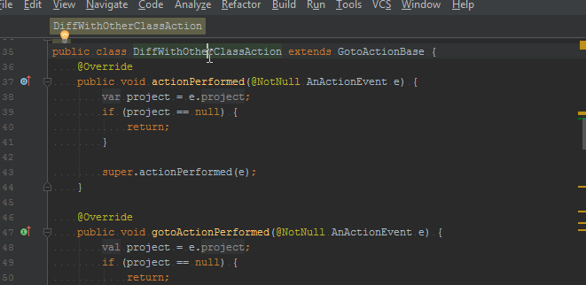

Compare With Class/File 1.0.0
=========================
 [![Build Status][badge-travis-img]][badge-travis]

Introduction
----------------------

*Compare With Class/File* is a plugin for IntelliJ that adds two actions:
- Compare current file with an other file in same project
- Compare current Class file with other Class File in same project

IDE already has compare functionality but don't let you chose easily a class or file managed in current project to 
compare with; you have to manually chose file in file tree.

This actions enable to chose easily a project file compare with. This is andy feature when you have multiple branches 
of same code base in one project.

Usage
--------------
Use one of the following actions (available by pressing <kbd>Ctrl</kbd> + <kbd>Shift</kbd> + <kbd>a</kbd>):
- "Compare With Any Class"
- "Compare With Any File"

You can change associated keymap in <kbd>File</kbd> > <kbd>Settings...</kbd> > <kbd>Keymap</kbd>.

